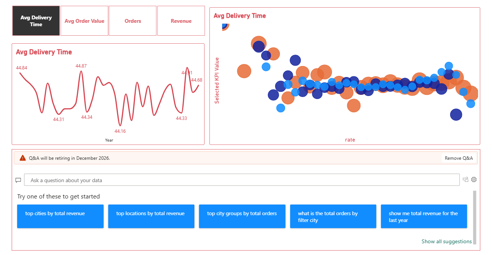
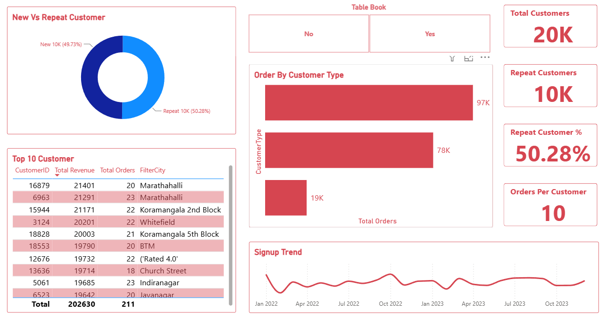
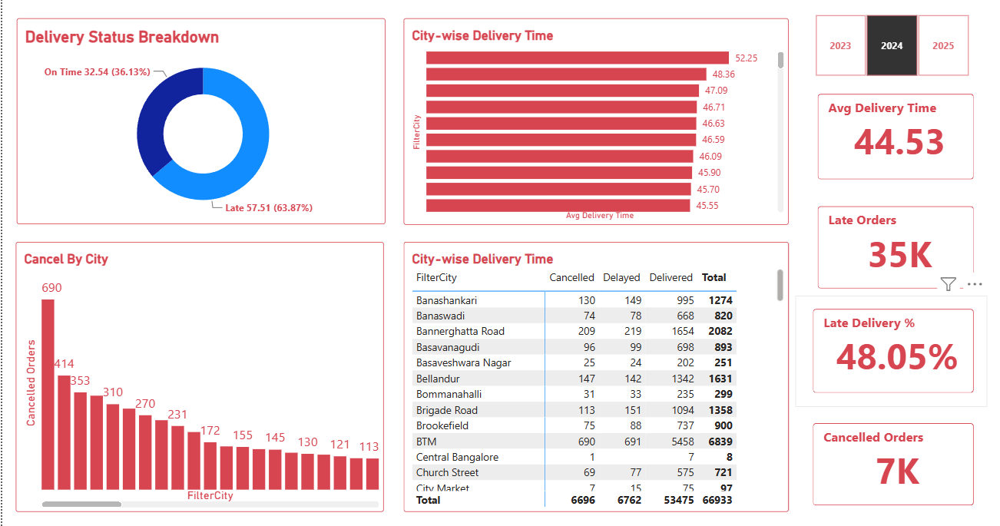
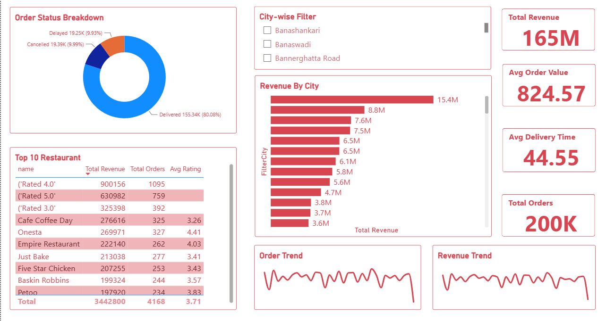
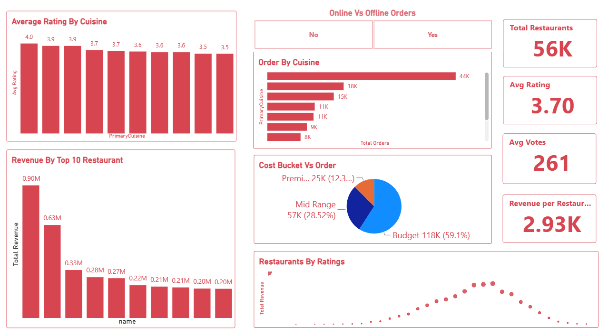
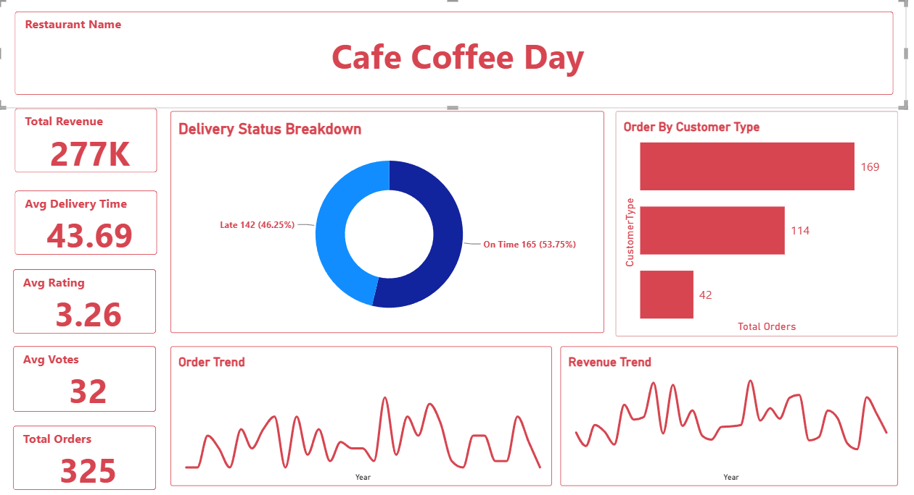

# Food Sales Analysis Dashboard

## Project Overview

This project analyzes food sales data using Power BI to identify sales trends, product performance, customer behavior, and profitability. The dashboard provides interactive visualizations and key business insights to support data-driven decision making.

## Business Objectives

* Analyze overall sales performance.
* Identify top-performing products and categories.
* Track revenue and profit trends.
* Monitor customer purchasing behavior.
* Support business decision-making through data visualization.

## Tools & Technologies

* Power BI
* DAX
* Power Query
* SQL
* Excel/CSV

## Data Cleaning & Transformation

* Removed duplicate records.
* Handled missing values.
* Corrected data types.
* Performed data transformation using Power Query.
* Created calculated columns and measures.

## Key DAX Measures

* Total Revenue
* Total Profit
* Total Orders
* Profit Margin

## Dashboard Features

* KPI Cards
* Revenue Analysis
* Profit Analysis
* Category-wise Sales Analysis
* Monthly Sales Trends
* Interactive Filters and Slicers

## Key Insights

* Identified top-selling products.
* Analyzed profit contribution by category.
* Tracked sales growth over time.
* Compared performance across different categories.
* Highlighted opportunities for business improvement.

## Project Workflow

1. Business Understanding
2. Data Collection
3. Data Cleaning
4. Data Transformation
5. Data Modeling
6. DAX Calculations
7. Dashboard Development
8. Insights & Recommendations

## Dashboard Screenshots

### Advance Insight

### Customer Analytics
 

### Delivery and Operation

### Executive Overview

### Restaurant Performance

### Restaurant

## Repository Structure

Food-Sales-Analysis/

├── Dataset/

├── Dashboard.pbix

├── Screenshots/

├── Documentation.pdf

└── README.md

## Conclusion

This Power BI dashboard transforms raw sales data into meaningful business insights, helping stakeholders understand sales performance and make informed decisions.
